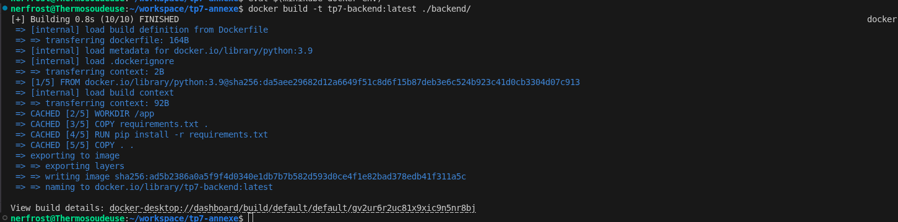
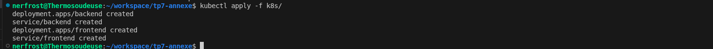
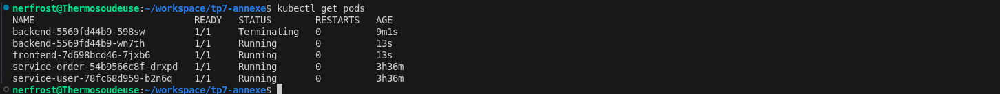
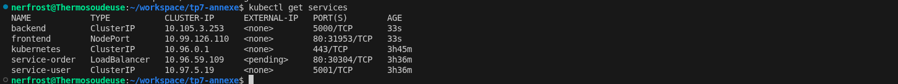
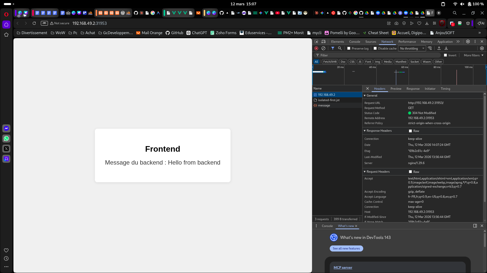

# TP7 Annexe - Frontend + Backend avec Kubernetes

## Projet

Une appli avec un frontend (Nginx) et un backend (Flask) déployé sur Kubernetes avec Minikube. Le frontend affiche une page HTML qui appel l'API du backend et affiche le message retourné.

## Architecture

backend/ API Flask avec une route GET /api/message
frontend/ Page HTML servie par Nginx avec un proxy vers le backend
k8s/ Manifestes Kubernetes (Deployments + Services)

Le frontend utilise un reverse proxy Nginx pour transmettre les requetes /api vers le Service backend dans le cluster Kubernetes.

backend-deployment.yaml : déploie le pod backend
backend-service.yaml : expose le backend en ClusterIP (interne au cluster)
frontend-deployment.yaml : déploie le pod frontend
frontend-service.yaml : expose le frontend en NodePort (accessible depuis l'exterieur)

## Lancer le projet

eval $(minikube docker-env)
docker build -t tp7-backend:latest ./backend/ //j'utilise çette syntaxte au taff
docker build -t tp7-frontend:latest ./frontend/
kubectl apply -f k8s/
kubectl get pods
kubectl get services

Tester : minikube service frontend --url puis ouvrir l'URL dans le navigateur

# TP7-Annexe
